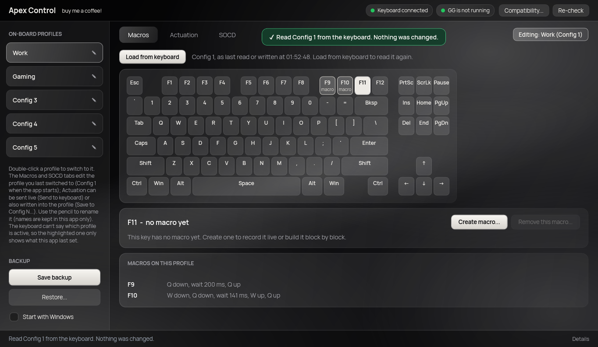
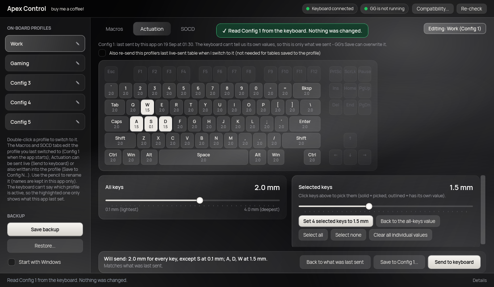
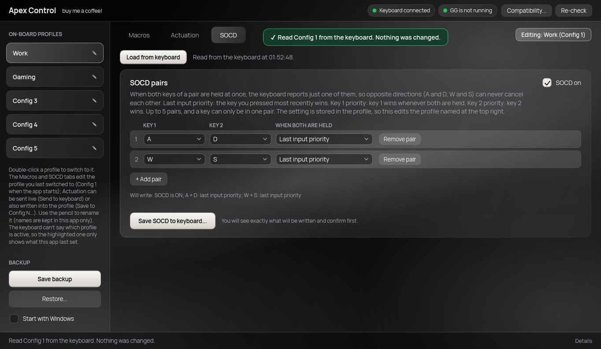
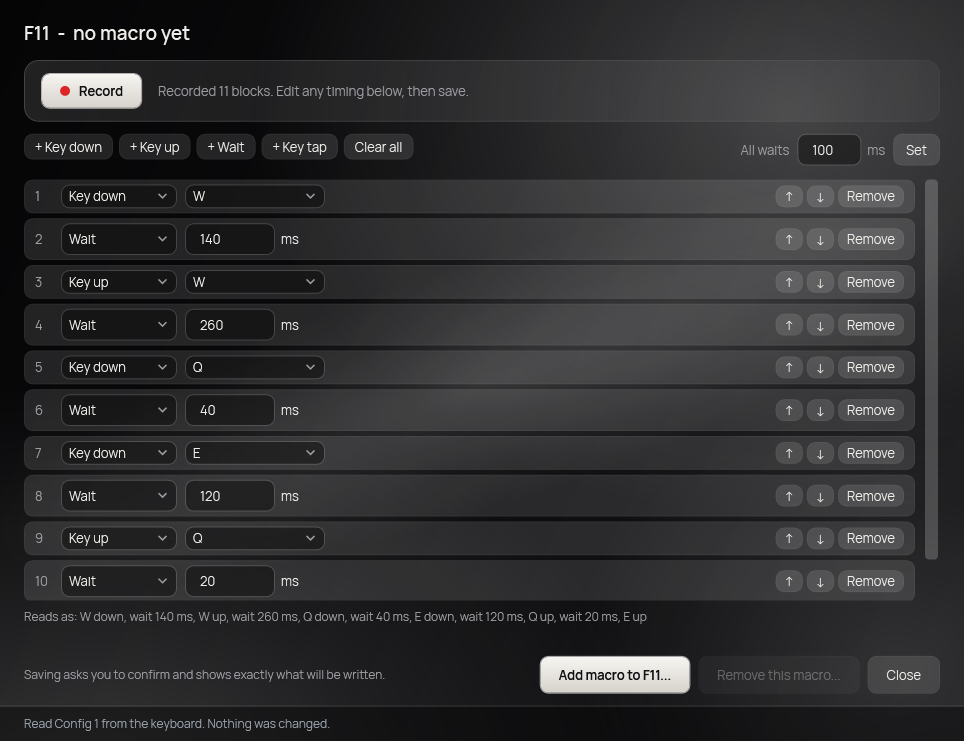
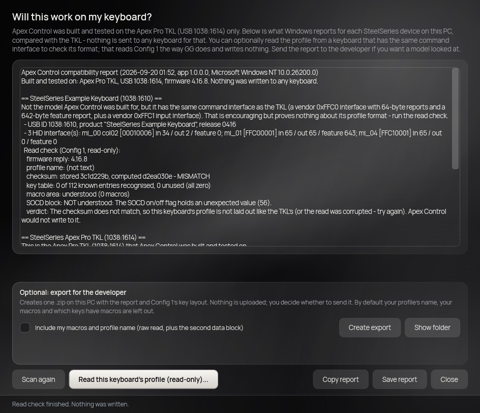

# ApexControl

A small, local-only replacement for the parts of SteelSeries GG that matter, for the
original **wired Apex Pro TKL (model 64734, USB `1038:1614`)**. No account, no cloud, no
telemetry. Everything here was reverse-engineered from USB captures of GG talking to this
exact keyboard, and every write replays bytes GG itself was seen sending.

## Screenshots

Sample data only (made-up profile names), rendered by the app's built-in preview mode.

**Macros:** click a key, then record a macro live or build it block by block.



**Actuation:** set every key or individual keys, then send it live or save it into the profile.



**SOCD:** up to five key pairs (last input, key 1 or key 2 priority), on or off.



**Macro editor:** record with the keyboard or edit the timings block by block.


## Does it work on my keyboard?

Apex Control is built and tested on the wired Apex Pro TKL only, and it never writes to any other model. If you have a different Apex, the **Compatibility...** window (top bar) shows what Windows reports for your keyboard and can optionally read its profile to see whether it has the TKL's layout. Nothing is uploaded: you copy the report or attach the export yourself.



**[Send a compatibility report](https://github.com/zunuza/apex-control/issues/new?template=compatibility.md)** (opens a pre-filled issue with the steps).
**Out of scope, on purpose:** RGB and OLED (not worth the effort), and actuation values
above 3.6 mm other than the 4.0 mm maximum (nobody uses them).

## Status

| Feature | Tool | State |
|---|---|---|
| Global actuation (0.1–3.6 mm, plus 4.0 mm) | `ApexActuation` | built, hardware-tested |
| Per-key actuation | `ApexActuation` | built, hardware-tested |
| Macros: add, replace, remove, restore a backup | `ApexMacro` | built, offline-verified, hardware-tested, GG reads the result |
| Read all 5 profile slots (backup) | `ApexMacro dump` | hardware-tested, byte-identical to GG's own read |
| Switch active profile (Config 1–5) | `ApexMacro profile` | built, offline-verified, hardware-tested both ways |
| Device inspection | `ApexDeviceScan` | read-only diagnostic |
| Desktop app: Profiles, Macros, Actuation and SOCD tabs, plus Save backup / Restore | `ApexControl` (WPF) | built and checked offline (macro encoding matches GG byte-for-byte); not yet clicked through on hardware |

Full protocol write-up, evidence, corrections and open questions: **`docs/PROTOCOL_NOTES.md`**.

## Before you run anything against the keyboard

- **Quit SteelSeries GG completely** (tray icon → Quit, not just closing the window). GG holds
  the keyboard's vendor interface and the tools refuse to run while it's up.
- Run commands from the tool's own folder, e.g.
  `cd "…\ApexControl phase 2\tools\ApexMacro"`, then `dotnet run -- <command>`.
- Every command that changes anything takes **`--dry-run`**, which does everything except send.

## The tools

### `tools/ApexMacro`

```
dotnet run -- dump                     read all 5 profiles (read-only) and save them to backups/<time>/
dotnet run -- bind F11 Q --hold 100    bind a key to a macro (W+Q = keys pressed together); replaces an existing macro
dotnet run -- unbind F11               remove a key's macro, restore its normal function
dotnet run -- restore "<backup dir>"   write a saved slot-1 backup back to the keyboard
dotnet run -- profile 2                switch the active profile (Config 1–5)
dotnet run -- verify                   offline: rebuild GG's captured transactions and check them byte-for-byte
dotnet run -- verify-dump              offline: check the read sequence against GG's captured startup read
dotnet run -- compat [--read]           read-only: is this keyboard like the TKL? (--read also reads Config 1)
```

`bind`, `unbind` and `restore` write **slot 1 ("Config 1") only**, and always: read the slot
fresh, refuse if its checksum is invalid, print the exact bytes that will change, save a
pre-write backup, wait for you to type `WRITE` (or `RESTORE`), write with GG's own timing and
acknowledgements, then read the slot back and verify it. On any missing acknowledgement they stop
without finalizing and tell you to `restore`.

Things to know:
- **The keyboard can't report which profile is active.** Every read/write session ends with
  `89 01`, which selects Config 1, so `dump`/`bind`/`unbind`/`restore` leave Config 1 active.
  (`dump --activate N` chooses another for a read-only dump; `profile N` switches.)
- Only Config 1 has macros right now; that's how you can tell by feel which profile is active.
- GG rewrites profiles from its own copy when you save in it, but it re-reads the keyboard at
  startup, so our edits show up in GG (checked: hold times, added and removed macros).
- Macro area capacity is unknown; the tool caps the area at 512 bytes.

### `tools/ApexActuation`

```
dotnet run -- 2.0 S=0.1                global 2.0 mm, but S at 0.1 mm
dotnet run -- 4.0 S=0.1                everything at the 4.0 mm maximum, S light (handy for testing)
dotnet run -- --list                   the values it can send
dotnet run -- 2.0 S=0.1 --dry-run
```

It only ever sends raw values captured from GG (a requested mm snaps to the nearest one), never
interpolated ones, and excludes 3.2 mm, which caused key-repeat on this keyboard. Available values:
0.1–3.1, 3.3–3.6 and 4.0 mm. Keys: letters, digits, common named keys.

### `src/ApexControl.App` (desktop app)

A WPF window over the same library the console tools use. Run it with GG fully quit:

```
dotnet run --project src\ApexControl.App
```

- **Layout, like GG's:** the five on-board profiles down the left (double-click one to switch the keyboard to it; the highlighted one shows what this app last set; the pencil renames a profile, and names are kept in this app only), **Macros**, **Actuation** and **SOCD** tabs across the top, dark monochrome theme (a dimmed black-and-white liquid-glass background, frosted-glass panels, off-white accents). The window is called **Apex Control**, is a fixed size (1380 x 832), and carries a small "buy me a coffee!" link to the author's Ko-fi. Save backup / Restore live at the bottom of the sidebar.
- **Save backup** reads all 5 profiles (read-only) and saves a copy to `backups/`. **Restore...** opens a picker of the saved copies and writes the chosen one back to Config 1, after showing what you picked and asking you to confirm, then reads it back to verify. Macro writes also save a pre-write copy automatically.
- The header shows whether the keyboard is connected and whether GG is running (it must not be);
  action buttons are disabled until that's true. Progress and a log of every step are at the bottom.
- **Macros:** "Load from keyboard" reads slot 1 (read-only) and lights up the keys that have macros on an on-screen keyboard. Click a key to pick it (click it again to put it down); a small panel shows what it does and offers **Create / Edit macro...**, which opens the macro editor pop-up. In the pop-up you can press **Record**, then type the keys you want: every press, release and pause is captured live (only from that window, never system-wide; numpad and media keys aren't supported, and a pause is capped at 5 s). Stopping releases anything still held. The result is a timeline of *Key down*, *Key up* and *Wait* blocks (waits 1-5000 ms, up to 60 blocks) that you can edit by hand: change any timing, set all waits at once, add, reorder or delete blocks. Every key that goes down must come back up later, or the app refuses. GG-made macros in a shape this app couldn't have written show as "Custom sequence" and can be replaced or deleted but not edited. The encoding, including waits between keys, is confirmed byte-for-byte against GG's own saves. Saving opens a dialog with the exact bytes that will change (Cancel is the default); on confirm the app re-reads slot 1 and refuses if it no longer matches what you were shown, saves a pre-write backup, writes, then reads back to verify, and the pop-up closes.
- **SOCD:** up to 5 pairs of keys (for example A + D, W + S) so that when both keys of a pair are held the keyboard reports just one: last input priority, key 1 priority or key 2 priority, plus an on/off switch. Read from Config 1 with *Load from keyboard*, edit the rows, and *Save SOCD to keyboard...* shows exactly which bytes change (only the SOCD block and the checksum can), saves a pre-write backup, writes the way GG does (including GG's live on/off command when the switch flips), and reads it back. The layout was decoded from eight of GG's own saves and reproduced byte-for-byte; it has not yet been tried on the real keyboard. The Macros and SOCD tabs edit the profile last switched to in the sidebar (Config 1 at start-up); each drops its copy when the other one writes, or when you switch profile, so neither can save over the other's changes. Turning SOCD on or off sends GG's live on/off command first, exactly as GG does on Config 1 and Config 2 (both captured).
- **Compatibility...** (top bar) answers "will this work on another Apex keyboard?". It lists every SteelSeries device Windows sees and compares its USB interfaces with the Apex Pro TKL's; that step sends nothing to any keyboard. Optionally, for a device with the same command interface, *Read this keyboard's profile* reads Config 1 the way GG does at startup (nothing is written; GG must be closed) and tests whether the profile has the TKL's format: checksum, key table, macro area, SOCD block. The result is one text report you can copy or save (no serial numbers or device paths). There is also an opt-in *Create export*: after a read it writes one .zip on your PC (nothing is uploaded; you choose whether to send it) with the report and Config 1's key layout, with your profile name, macros and which keys have macros left out unless you tick *Include my macros and profile name*. The console equivalent is `ApexMacro compat [--read] [--export [--full]]`. Only the Apex Pro TKL is supported for anything else; this just tells you (and the developer) how close another model is.
- **Actuation:** a slider for every key plus an on-screen keyboard where you click keys to give them their own
  depth. Only the depths GG itself was seen sending are offered (0.1-3.1, 3.3-3.6, 4.0 mm; 3.2 is left out because
  it made keys repeat). Nothing is sent until you press *Send to keyboard*, which sends the whole table live
  (no profile is read or written). The keyboard can't report its actuation, so the tab shows what this app last
  sent (remembered in `%LOCALAPPDATA%\ApexControl\actuation.json`), and GG's Save writes its own values over it.
  Esc, the F-row, the navigation block and the arrows aren't part of GG's actuation command and are greyed.
- Backups are shared with the console tools (`backups/`).
- Development aids (none of them sends anything to the keyboard): `ApexControl.exe --preview <folder>` renders
  each tab and the confirm dialog to PNGs from canned data; `--selftest <file>` reports what the real backend can
  see; `--selftest-macros <file>`, `--selftest-actuation <file>`, `--selftest-recorder <file>`, `--selftest-compat <file>`, `--selftest-socd <file>` and `--selftest-profiles <file>` drive those tabs' logic against canned data and\n  print pass/fail lines.

### `tools/ApexDeviceScan`

Read-only: lists HID interfaces and report descriptors (`dotnet run`). Its output for this keyboard
is `docs/apex-device-scan-baseline.log` (kept local, not in git: it lists every USB device on the PC,
including other devices' serial numbers).

## Build

Needs the free [.NET 8 SDK](https://dotnet.microsoft.com/download/dotnet/8.0) on Windows (uses
HidSharp, Apache-2.0-licensed, restored automatically). `dotnet build` in any tool folder. A from-scratch
copy of just the sources and docs (under 1 MB) builds and passes `verify`.

### Building the app as a single .exe

```
dotnet publish src\ApexControl.App -c Release -r win-x64 --self-contained false -p:PublishSingleFile=true -o publish
```

For a copy that needs no .NET install on the other PC (about 69 MB), publish self-contained instead:

```
dotnet publish src\ApexControl.App -c Release -r win-x64 --self-contained true -p:PublishSingleFile=true -p:IncludeNativeLibrariesForSelfExtract=true -p:EnableCompressionInSingleFile=true -p:DebugType=None -p:DebugSymbols=false -o publish-standalone
```

This produces `publish\ApexControl.exe` (about 1 MB; needs the .NET 8 Desktop Runtime, which the SDK already installs). The
window's close button hides Apex Control to the system tray instead of quitting: left-click the tray icon to open it again, right-click
for **Open** / **Quit**. Quit is refused while a keyboard operation is running. **Start with Windows** (a switch at the bottom of the sidebar, off until you turn it on) adds a per-user startup entry that launches the exe with `--tray`, so it comes up hidden in the tray at sign-in; it points at whichever copy of the exe you turned it on from, so turn it off and on again if you move the file, and it respects Windows' own Settings > Apps > Startup switch. Starting the exe again while it is running just
shows the existing window (one copy at a time, since two would fight over the keyboard). The exe keeps its backups in the
repo's `backups/` folder if it lives inside the repo, and in `%LOCALAPPDATA%\ApexControl\backups` if you copy it elsewhere.
## Repository layout

```
src/ApexControl.App   the WPF desktop app (Profiles, Macros, Actuation; Save backup / Restore in the header)
src/ApexControl.Core  the shared library: keyboard link, read/write engine, macro editor, profile switching,
                      actuation, backups (no console or window code; the tools and the GUI both use it)
tools/            the three console tools above (thin front ends over the library)
ApexControl.sln    builds everything: dotnet build ApexControl.sln
docs/PROTOCOL_NOTES.md      the protocol, evidence, and open questions
docs/reference/             captured GG transactions the offline checks compare against
CAPTURE_GUIDE.md            how the Wireshark captures were made
captures/                   raw .pcapng captures of GG (167 MB; not in git; not needed to build or verify)
backups/                    keyboard profile dumps and pre-write backups (not in git; keep the newest few)
```

## Known gaps

- GG's own behavior when it *deletes* a macro was never captured; our re-packing of the macro area
  is proven on the keyboard and accepted by GG, but it is our design.
- Actuation for Esc, the F-row, arrows and the navigation cluster is not in GG's actuation frame;
  unknown whether it exists.
- Slots 2–5 can be read but not edited; macros are only written to slot 1.
- Not knowing what a couple of protocol bytes mean (`69`, and the macro record's `01 01 0f 00`
  settings unit) hasn't mattered because the tools replay them exactly as GG does.

## Credits

The app's typeface is **Hauora Sans** (c) 2020 WCYS & Co. / The Hauora Project Authors, used under the SIL Open Font License 1.1: https://github.com/WCYS-Co/Hauora-Sans. Three weights and the license text are bundled in `src/ApexControl.App/Fonts/`.

## License

MIT, Copyright (c) 2026 zunuza (see [LICENSE](LICENSE)). Third-party components (HidSharp under Apache 2.0, the Hauora Sans font under the SIL OFL, the .NET runtime under MIT) are listed in [THIRD-PARTY-NOTICES.txt](THIRD-PARTY-NOTICES.txt). Apex Control is an independent project, not affiliated with SteelSeries.
